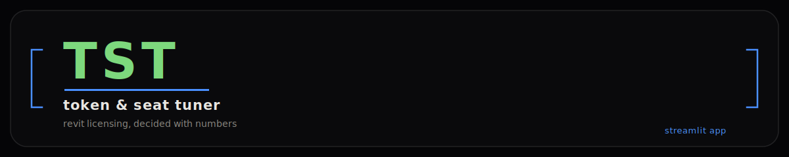
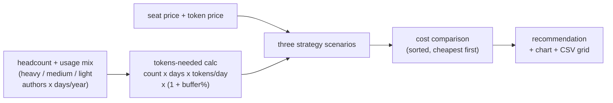

<p align="center">
  
</p>

<p align="center">
  
  
  
  
</p>

## what it is

TST (token & seat tuner) is a decision-support tool for Autodesk Revit licensing. It models your team as three usage cohorts — heavy authors, medium/occasional contributors, and light reviewers — each with their own headcount and active days per year, then compares the annual cost of named-user seats against Flex tokens across three strategies: **Lean**, **Balanced**, and **Max**.

Adjust seat price, token price, tokens consumed per Revit day, and a usage buffer in the sidebar, and the app recomputes cost for all three strategies live. It surfaces the cheapest option as a KPI-driven recommendation, a sortable cost table, a cost-by-strategy chart, and an optional price-sensitivity grid you can export to CSV.

## how the model thinks



| strategy | seats cover | flex tokens cover |
|---|---|---|
| **lean** | heavy authors only | medium + light authors |
| **balanced** | heavy + medium authors | light authors |
| **max** | all authors | small 5% burst reserve (1 day) |

Breakeven days per user is computed as `seat_price / (tokens_per_day x token_price)` — the number of Revit-days at which a Flex token spend equals one annual seat.

Turning on the price sensitivity grid runs every strategy across a cartesian product of candidate seat and token prices, so you can see which strategy wins as pricing shifts — the result is downloadable as CSV.

## quick start

```bash
pip install -r requirements.txt
streamlit run TST.py
```

## docker

```bash
docker build -t tst .
docker run --rm -p 8501:8501 tst
```

Then open http://localhost:8501.

<!-- TODO: screenshot — Ali drops assets/screenshot.png locally (binaries can't ship through this pipeline) -->

## privacy

Everything runs locally — no data leaves your machine. There's no external API call, no telemetry, and no server-side storage; inputs live in the Streamlit session and any exported CSV is generated and downloaded client-side.

## license

MIT — see [LICENSE](LICENSE).
